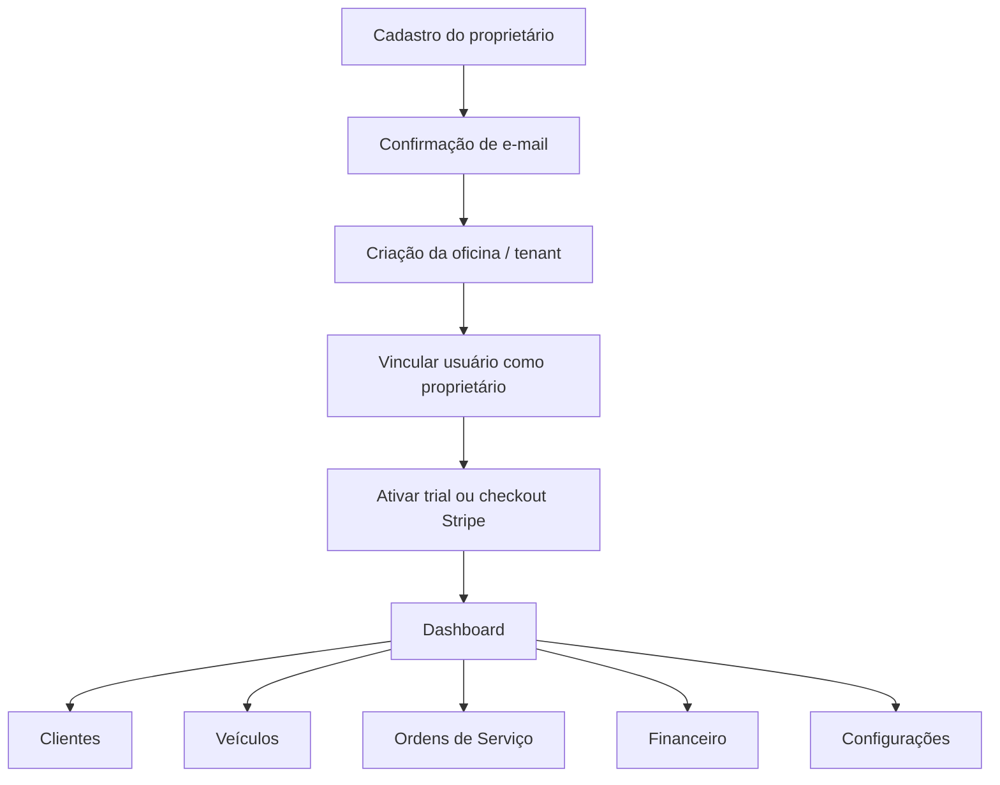

# OficinaPro — Especificação Técnica de Produto, Arquitetura SaaS e Documentação Funcional

**Autor:** Manus AI  
**Data:** 09 de junho de 2026  
**Versão:** 1.0  
**Finalidade:** Este documento define a visão de produto, arquitetura, módulos funcionais, modelo de dados, fluxos, telas, regras de negócio, segurança, stack tecnológica e roadmap do **OficinaPro**, uma plataforma SaaS multiempresa para gestão de oficinas mecânicas.

> O OficinaPro deve ser desenvolvido desde o primeiro commit como uma plataforma **SaaS multi-tenant**, na qual múltiplas oficinas utilizam a mesma aplicação, a mesma base PostgreSQL e a mesma infraestrutura, com isolamento lógico rigoroso por empresa, controle de acesso por perfil e políticas de segurança aplicadas no banco de dados.

## 1. Visão geral do produto

O **OficinaPro** é um software de gestão para oficinas mecânicas, auto centers, centros automotivos, oficinas de funilaria, oficinas de motos e prestadores de serviços automotivos. O produto tem como objetivo centralizar a operação diária da oficina, reduzindo controles manuais, planilhas dispersas e falhas de comunicação entre atendimento, mecânicos, financeiro e proprietário.

A plataforma deverá permitir que cada oficina cadastre seus clientes, veículos, serviços, produtos, ordens de serviço, receitas, despesas, usuários, permissões e assinatura. O sistema também deverá oferecer indicadores gerenciais para tomada de decisão, como faturamento, serviços em aberto, contas a receber, ticket médio, volume de ordens de serviço, margem estimada e status operacional.

### 1.1 Objetivo do sistema

O objetivo do OficinaPro é oferecer uma solução SaaS completa para digitalizar e organizar a gestão de oficinas mecânicas. A aplicação deverá contemplar desde o cadastro inicial da empresa até o controle da jornada operacional de uma ordem de serviço, passando por gestão financeira, dashboards, assinatura recorrente via Stripe e configurações administrativas.

| Objetivo | Descrição |
|---|---|
| Centralizar a operação | Reunir clientes, veículos, serviços, peças, ordens de serviço e financeiro em uma única aplicação. |
| Padronizar processos | Criar fluxos claros para abertura, diagnóstico, aprovação, execução e finalização de ordens de serviço. |
| Reduzir erros manuais | Diminuir retrabalho, perda de informações e inconsistências de cobrança. |
| Viabilizar escala SaaS | Permitir que milhares de oficinas utilizem a mesma plataforma com isolamento de dados. |
| Monetizar recorrência | Integrar planos mensal, anual, trial, upgrade e cancelamento com Stripe Billing. |

### 1.2 Público-alvo

O público-alvo primário é formado por pequenas e médias oficinas mecânicas que ainda utilizam planilhas, cadernos, sistemas locais antigos ou processos fragmentados. O público secundário inclui redes de oficinas, franquias automotivas e consultores de gestão automotiva que precisam acompanhar múltiplas unidades.

| Perfil | Necessidade principal | Valor entregue pelo OficinaPro |
|---|---|---|
| Proprietário de oficina | Controle financeiro, produtividade e visão geral do negócio. | Dashboard, relatórios, fluxo de caixa e gestão de permissões. |
| Administrador | Organizar cadastros, usuários, serviços, produtos e configurações. | Módulos administrativos e controle operacional. |
| Funcionário/atendente | Abrir OS, cadastrar clientes, veículos e registrar andamento. | Interface simples para operação diária. |
| Mecânico/técnico | Consultar diagnóstico, serviços e peças vinculadas à OS. | Acesso controlado a informações operacionais. |

### 1.3 Problemas que resolve

O OficinaPro resolve problemas comuns em oficinas que operam sem padronização digital. Entre esses problemas estão a perda de histórico de clientes e veículos, dificuldade para calcular valores de OS, falta de controle sobre peças utilizadas, ausência de previsão de recebimentos, falhas no acompanhamento de serviços em andamento e baixa visibilidade sobre o desempenho da oficina.

| Problema | Impacto no negócio | Solução proposta |
|---|---|---|
| Histórico disperso de veículos | Dificulta relacionamento e recorrência. | Cadastro completo de veículos vinculado ao cliente e histórico de OS. |
| OS manual ou informal | Gera divergência entre orçamento, execução e cobrança. | Fluxo estruturado de OS com status, itens, aprovação e finalização. |
| Falta de controle financeiro | Compromete caixa e decisão gerencial. | Módulo financeiro com receitas, despesas, contas a receber e pagar. |
| Dados sem isolamento | Risco crítico em SaaS multiempresa. | `tenant_id` obrigatório, RLS e políticas por empresa. |
| Cobrança recorrente manual | Dificulta escala comercial. | Assinaturas automatizadas com Stripe Billing. |

### 1.4 Diferenciais

Os principais diferenciais do OficinaPro são a concepção nativa como SaaS multiempresa, a arquitetura baseada em Supabase/PostgreSQL com Row Level Security, o uso de Stripe para recorrência e a estrutura modular pronta para expansão. A documentação foi pensada para permitir implementação progressiva com ferramentas como Cursor, Claude, ChatGPT, GitHub, Supabase, Stripe e Vercel.

| Diferencial | Descrição |
|---|---|
| Multiempresa desde a origem | Todas as entidades operacionais são vinculadas a uma empresa e protegidas por políticas de acesso. |
| Arquitetura moderna | Next.js 15, TypeScript, Tailwind CSS, shadcn/ui, Supabase, Stripe e Vercel. |
| Segurança no banco | O isolamento não depende apenas do frontend; ele deve ser reforçado com RLS no PostgreSQL. |
| Fluxo completo de OS | Abrange abertura, diagnóstico, aprovação, execução, produtos, totalização e finalização. |
| Pronto para monetização | Assinaturas com trial, mensal, anual, upgrade, cancelamento e webhooks de billing. |

## 2. Arquitetura geral

A arquitetura do OficinaPro será composta por uma aplicação web construída com **Next.js 15**, utilizando **TypeScript**, **Tailwind CSS** e **shadcn/ui** no frontend. O backend operacional será fornecido pelo **Supabase**, incluindo autenticação, banco PostgreSQL, storage e APIs geradas automaticamente. Os pagamentos recorrentes serão processados pela **Stripe**, e a hospedagem será realizada na **Vercel**.

A documentação oficial do Next.js define o framework como uma solução React para construção de aplicações web full-stack, com recursos adicionais e otimizações para desenvolvimento de interfaces e aplicações dinâmicas.[3] O Supabase recomenda que RLS esteja sempre habilitado em tabelas de schemas expostos, especialmente no schema `public`, pois as políticas funcionam como regras granulares de autorização diretamente no PostgreSQL.[1] A Stripe oferece APIs de Billing para criação e gestão de assinaturas recorrentes, incluindo períodos de cobrança, trials, webhooks e portal do cliente.[2]

> Segundo a documentação do Supabase, “RLS must always be enabled on any tables stored in an exposed schema”. Essa diretriz será tratada como requisito obrigatório para todas as tabelas multi-tenant do OficinaPro.[1]

### 2.1 Modelo SaaS multiempresa

O OficinaPro utilizará o padrão **single application, shared database, tenant isolation by row**. Nesse modelo, todas as oficinas compartilham a mesma aplicação e o mesmo banco de dados, porém cada registro operacional contém um campo obrigatório `tenant_id`, que identifica a empresa proprietária do dado.

| Camada | Responsabilidade | Decisão arquitetural |
|---|---|---|
| Interface | Renderizar telas, formulários, dashboards e navegação. | Next.js App Router com componentes shadcn/ui. |
| Autenticação | Login, cadastro, sessão, reset de senha e confirmação de e-mail. | Supabase Auth. |
| Autorização | Determinar o que cada usuário pode visualizar e alterar. | Perfis internos, permissões e RLS no PostgreSQL. |
| Dados | Persistir informações operacionais e financeiras. | PostgreSQL via Supabase. |
| Arquivos | Armazenar logotipos e possíveis anexos futuros. | Supabase Storage com path por tenant. |
| Pagamentos | Assinaturas, trials, upgrades, cancelamentos e webhooks. | Stripe Billing e Stripe Checkout/Customer Portal. |
| Deploy | Publicação, preview e produção. | GitHub integrado à Vercel. |

### 2.2 Conceitos centrais de tenancy

O sistema deverá possuir uma tabela `tenants`, representando cada oficina contratante. Cada usuário autenticado poderá pertencer a uma ou mais oficinas por meio da tabela `tenant_users`. Cada entidade operacional deverá conter `tenant_id`, exceto entidades globais estritamente necessárias, como catálogo interno de planos ou logs de webhook.

| Conceito | Definição |
|---|---|
| Tenant | Empresa/oficina que contrata e utiliza o OficinaPro. |
| Usuário | Pessoa autenticada pelo Supabase Auth. |
| Membro do tenant | Associação entre usuário e oficina, contendo perfil e status. |
| Contexto ativo | Oficina selecionada pelo usuário para operar no sistema. |
| Isolamento lógico | Garantia de que consultas, mutações e relatórios só retornem dados do tenant autorizado. |

### 2.3 Estrutura de permissões

O sistema possuirá três perfis iniciais: **Proprietário**, **Administrador** e **Funcionário**. O proprietário é criado automaticamente no momento de criação da oficina. O administrador é convidado ou cadastrado pelo proprietário e possui permissões amplas, exceto ações críticas de assinatura e exclusão da empresa. O funcionário possui acesso operacional limitado.

| Recurso | Proprietário | Administrador | Funcionário |
|---|---:|---:|---:|
| Visualizar dashboard | Sim | Sim | Limitado |
| Gerenciar dados da oficina | Sim | Sim | Não |
| Gerenciar dados fiscais | Sim | Sim | Não |
| Gerenciar usuários | Sim | Sim, exceto proprietário | Não |
| Cadastrar clientes | Sim | Sim | Sim |
| Editar clientes | Sim | Sim | Sim, se permitido |
| Excluir clientes | Sim | Sim | Não |
| Cadastrar veículos | Sim | Sim | Sim |
| Gerenciar serviços | Sim | Sim | Não |
| Gerenciar produtos | Sim | Sim | Não |
| Abrir OS | Sim | Sim | Sim |
| Aprovar OS em nome da oficina | Sim | Sim | Não |
| Finalizar OS | Sim | Sim | Sim, se permitido |
| Registrar pagamentos | Sim | Sim | Não |
| Ver financeiro completo | Sim | Sim | Não |
| Gerenciar assinatura | Sim | Não | Não |
| Cancelar assinatura | Sim | Não | Não |

### 2.4 Fluxo geral da aplicação

O fluxo geral começa no cadastro do usuário proprietário. Após confirmar e-mail, o usuário cria ou completa o cadastro da oficina. Em seguida, o sistema cria o tenant, vincula o usuário como proprietário e inicia um trial ou direciona o usuário para checkout conforme configuração comercial. Depois disso, a oficina acessa o painel principal e pode cadastrar clientes, veículos, serviços, produtos e ordens de serviço.



## 3. Módulos do sistema

Os módulos do OficinaPro devem ser implementados de forma incremental e coesa. Cada módulo deverá respeitar o contexto do tenant ativo, as permissões do usuário autenticado e as políticas de RLS no banco de dados.

### 3.1 Autenticação

O módulo de autenticação será responsável por cadastro, login, recuperação de senha, alteração de senha e confirmação por e-mail. Recomenda-se utilizar o Supabase Auth para reduzir complexidade operacional e integrar autenticação diretamente com políticas de banco por meio de `auth.uid()`.[1]

| Funcionalidade | Descrição | Regras principais |
|---|---|---|
| Cadastro | Criação da conta do usuário proprietário. | Exigir nome, e-mail, senha forte e aceite de termos. |
| Login | Entrada com e-mail e senha. | Bloquear acesso a usuários inativos ou sem tenant. |
| Recuperação de senha | Envio de link de redefinição. | Link expira conforme configuração do Supabase. |
| Alteração de senha | Atualização de senha por usuário autenticado. | Exigir confirmação da nova senha. |
| Confirmação por e-mail | Validação de e-mail antes do uso pleno. | Usuário não confirmado não deve criar dados operacionais. |

### 3.2 Empresas/oficinas

O módulo de empresas representa o cadastro da oficina contratante. Cada empresa é um tenant e deverá possuir informações cadastrais, fiscais, contato, endereço, logotipo e preferências operacionais.

| Campo | Tipo sugerido | Obrigatório | Observação |
|---|---|---:|---|
| Razão social | `text` | Sim | Nome jurídico da empresa. |
| Nome fantasia | `text` | Sim | Nome exibido no sistema e documentos. |
| CNPJ/CPF | `text` | Não na fase inicial | Deve ser validado quando preenchido. |
| Inscrição estadual | `text` | Não | Campo fiscal opcional. |
| E-mail | `text` | Sim | E-mail principal da oficina. |
| Telefone | `text` | Sim | Preferencialmente com máscara nacional. |
| WhatsApp | `text` | Não | Usado para contato com clientes. |
| Logo | `text` | Não | URL de arquivo no Supabase Storage. |
| Endereço | campos separados | Não | CEP, rua, número, bairro, cidade, estado, complemento. |
| Horário de funcionamento | `jsonb` | Não | Estrutura flexível por dia da semana. |

### 3.3 Usuários

Usuários são pessoas autenticadas e vinculadas a uma oficina por meio de associação. Um mesmo usuário poderá, futuramente, participar de mais de uma oficina, embora a primeira versão possa priorizar um tenant ativo por sessão.

| Perfil | Finalidade | Limitações |
|---|---|---|
| Proprietário | Dono da oficina e responsável pela assinatura. | Não pode ser removido se for o único proprietário ativo. |
| Administrador | Gestão operacional e administrativa. | Não gerencia assinatura nem remove proprietário. |
| Funcionário | Execução de rotinas do dia a dia. | Sem acesso a financeiro completo, assinatura e configurações críticas. |

### 3.4 Clientes

O módulo de clientes armazenará informações de pessoas físicas ou jurídicas atendidas pela oficina. O cadastro deve ser simples, mas completo o suficiente para relacionamento, histórico e cobrança.

| Campo | Tipo sugerido | Obrigatório | Descrição |
|---|---|---:|---|
| Nome/Razão social | `text` | Sim | Nome principal do cliente. |
| Tipo de cliente | `enum` | Sim | `individual` ou `company`. |
| CPF/CNPJ | `text` | Não | Validar quando informado. |
| RG/IE | `text` | Não | Documento complementar. |
| E-mail | `text` | Não | Usado para comunicação. |
| Telefone | `text` | Não | Telefone fixo ou principal. |
| WhatsApp | `text` | Não | Contato rápido. |
| Data de nascimento | `date` | Não | Para pessoa física. |
| Observações | `text` | Não | Informações livres. |
| Endereço completo | campos separados | Não | CEP, rua, número, bairro, cidade, UF, complemento. |
| Status | `enum` | Sim | `active` ou `inactive`. |

### 3.5 Veículos

O módulo de veículos deverá vincular cada veículo a um cliente e armazenar dados técnicos e de identificação. Um cliente poderá ter múltiplos veículos, e um veículo deverá pertencer a apenas um cliente por vez na versão inicial.

| Campo | Tipo sugerido | Obrigatório | Descrição |
|---|---|---:|---|
| Cliente | `uuid` | Sim | FK para `customers`. |
| Placa | `text` | Sim | Deve ser única por tenant. |
| Marca | `text` | Sim | Exemplo: Toyota, Fiat, Honda. |
| Modelo | `text` | Sim | Exemplo: Corolla, Uno, Civic. |
| Ano fabricação | `integer` | Não | Ano de fabricação. |
| Ano modelo | `integer` | Não | Ano modelo. |
| Cor | `text` | Não | Cor predominante. |
| Renavam | `text` | Não | Documento do veículo. |
| Chassi | `text` | Não | Identificador técnico. |
| Quilometragem atual | `integer` | Não | Usada em histórico de manutenção. |
| Tipo de combustível | `enum` | Não | gasolina, etanol, flex, diesel, elétrico, híbrido, outro. |
| Observações | `text` | Não | Histórico ou particularidades. |
| Status | `enum` | Sim | `active` ou `inactive`. |

### 3.6 Serviços

O cadastro de serviços padroniza itens de mão de obra e atividades recorrentes, como troca de óleo, alinhamento, revisão, diagnóstico eletrônico e substituição de peças. Serviços cadastrados poderão ser usados em ordens de serviço.

| Campo | Tipo sugerido | Obrigatório | Descrição |
|---|---|---:|---|
| Nome | `text` | Sim | Nome do serviço. |
| Código interno | `text` | Não | Identificação opcional. |
| Categoria | `text` | Não | Exemplo: manutenção, elétrica, suspensão. |
| Descrição | `text` | Não | Detalhes do serviço. |
| Valor padrão | `numeric(12,2)` | Sim | Preço sugerido. |
| Tempo estimado | `integer` | Não | Em minutos. |
| Ativo | `boolean` | Sim | Serviços inativos não aparecem para novas OS. |

### 3.7 Produtos e peças

Produtos representam peças, insumos e itens cobrados na OS. A primeira versão pode operar sem controle avançado de estoque, mas a modelagem deve permitir evolução futura para movimentações e inventário.

| Campo | Tipo sugerido | Obrigatório | Descrição |
|---|---|---:|---|
| Nome | `text` | Sim | Nome da peça ou produto. |
| SKU/código | `text` | Não | Código interno ou de fornecedor. |
| Categoria | `text` | Não | Exemplo: filtros, óleo, pneus, pastilhas. |
| Descrição | `text` | Não | Detalhes do produto. |
| Unidade | `text` | Sim | un, litro, kit, par etc. |
| Custo | `numeric(12,2)` | Não | Custo de aquisição. |
| Preço de venda | `numeric(12,2)` | Sim | Valor cobrado do cliente. |
| Estoque atual | `numeric(12,3)` | Não | Preparado para controle de estoque. |
| Estoque mínimo | `numeric(12,3)` | Não | Alerta futuro. |
| Ativo | `boolean` | Sim | Produtos inativos não aparecem para novas OS. |

### 3.8 Ordem de Serviço

A Ordem de Serviço, ou OS, é o núcleo operacional do OficinaPro. Ela conecta cliente, veículo, diagnóstico, serviços, produtos, aprovações, valores e pagamentos. O fluxo deve ser rastreável e orientado a status.

| Status | Significado | Próximos status permitidos |
|---|---|---|
| `draft` | OS rascunho, ainda incompleta. | `open`, `cancelled` |
| `open` | OS aberta e aguardando diagnóstico. | `diagnosis`, `cancelled` |
| `diagnosis` | Veículo em análise técnica. | `waiting_approval`, `in_progress`, `cancelled` |
| `waiting_approval` | Orçamento enviado ou aguardando aprovação. | `approved`, `cancelled` |
| `approved` | Cliente aprovou execução. | `in_progress`, `cancelled` |
| `in_progress` | Serviços em execução. | `completed`, `cancelled` |
| `completed` | Serviços concluídos, aguardando pagamento/retirada. | `delivered`, `reopened` |
| `delivered` | Veículo entregue e OS finalizada. | Nenhum, exceto reabertura controlada. |
| `cancelled` | OS cancelada. | Nenhum, exceto duplicação. |
| `reopened` | OS reaberta por ajuste ou correção. | `in_progress`, `completed` |

A OS deverá conter campos de diagnóstico, relato do cliente, observações internas, quilometragem de entrada, previsão de entrega, data de aprovação, responsável técnico, valores de serviços, produtos, descontos, acréscimos, impostos quando aplicável e valor total. Itens de serviço e produto devem ser armazenados em tabelas filhas para preservar histórico de preço no momento da OS.

### 3.9 Financeiro

O módulo financeiro deverá registrar receitas, despesas, fluxo de caixa, contas a receber e contas a pagar. A finalização ou aprovação de uma OS poderá gerar automaticamente uma conta a receber, conforme configuração da oficina.

| Submódulo | Objetivo | Entidades principais |
|---|---|---|
| Receitas | Registrar entradas financeiras. | `financial_transactions`, `accounts_receivable`. |
| Despesas | Registrar saídas financeiras. | `financial_transactions`, `accounts_payable`. |
| Fluxo de caixa | Visualizar entradas, saídas e saldo por período. | Transações financeiras por competência ou caixa. |
| Contas a receber | Controlar valores pendentes de clientes. | Recebíveis vinculados ou não a OS. |
| Contas a pagar | Controlar compromissos da oficina. | Despesas com fornecedores, aluguel, salários e insumos. |

### 3.10 Dashboard

O dashboard deverá apresentar indicadores gerenciais e operacionais de forma clara. Na primeira versão, os dados poderão ser calculados por consultas agregadas em views com `security_invoker = true` quando aplicável, respeitando RLS.[1]

| Indicador | Descrição |
|---|---|
| Faturamento do mês | Soma de receitas confirmadas no mês. |
| OS abertas | Quantidade de ordens não finalizadas. |
| OS concluídas | Quantidade de OS finalizadas no período. |
| Contas a receber | Total pendente por vencimento. |
| Contas a pagar | Total pendente por vencimento. |
| Ticket médio | Faturamento de OS dividido pela quantidade de OS faturadas. |
| Produtos mais utilizados | Ranking de peças/produtos em OS. |
| Serviços mais vendidos | Ranking de serviços por quantidade e valor. |

### 3.11 Assinaturas

O módulo de assinaturas integrará o OficinaPro à Stripe. A Stripe disponibiliza recursos para criar e gerenciar assinaturas recorrentes, períodos de cobrança, trials, webhooks e portal de autoatendimento do cliente.[2]

| Funcionalidade | Descrição |
|---|---|
| Plano mensal | Cobrança recorrente mensal. |
| Plano anual | Cobrança recorrente anual, com possibilidade de desconto. |
| Trial | Período gratuito configurável para novos tenants. |
| Upgrade | Mudança para plano superior com atualização no Stripe. |
| Cancelamento | Cancelamento imediato ou ao fim do período, conforme política comercial. |
| Webhooks | Sincronização de status de pagamento, assinatura e inadimplência. |
| Portal do cliente | Gestão de forma de pagamento, faturas e cancelamento quando habilitado. |

### 3.12 Configurações

O módulo de configurações reunirá perfil do usuário, empresa, usuários, preferências operacionais, preferências financeiras e assinatura. Cada tela de configuração deve validar permissões antes de exibir ou permitir alterações.

| Área | Funcionalidades |
|---|---|
| Perfil | Nome, telefone, avatar, senha e preferências pessoais. |
| Empresa | Dados cadastrais, fiscais, contato, logo e endereço. |
| Usuários | Convites, perfis, ativação, inativação e remoção. |
| Preferências | Numeração de OS, moeda, padrão de vencimento, mensagens e permissões operacionais. |
| Assinatura | Plano atual, status, trial, faturas e portal Stripe. |

## 4. Banco de dados para Supabase/PostgreSQL

O banco de dados deve ser projetado para PostgreSQL e executado no Supabase. Todas as tabelas operacionais deverão conter `id uuid primary key`, `tenant_id uuid not null`, `created_at timestamptz not null default now()`, `updated_at timestamptz not null default now()` e, quando apropriado, `deleted_at timestamptz` para exclusão lógica.

A estratégia recomendada é criar enums PostgreSQL para status e tipos recorrentes, índices compostos com `tenant_id`, constraints de unicidade por tenant e triggers para atualização automática de `updated_at`.

### 4.1 Convenções gerais

| Convenção | Padrão |
|---|---|
| Identificadores | `uuid` com `gen_random_uuid()`. |
| Datas | `timestamptz` para eventos; `date` para vencimentos e datas civis. |
| Valores monetários | `numeric(12,2)`, nunca `float`. |
| Exclusão | Preferir `deleted_at` para dados operacionais. |
| Multi-tenant | `tenant_id` obrigatório em tabelas de domínio. |
| Auditoria | `created_by` e `updated_by` quando houver rastreabilidade operacional. |

### 4.2 Tabelas principais

#### 4.2.1 `tenants`

| Campo | Tipo | Chave | Descrição |
|---|---|---|---|
| `id` | `uuid` | PK | Identificador da oficina. |
| `legal_name` | `text` |  | Razão social. |
| `trade_name` | `text` |  | Nome fantasia. |
| `document` | `text` |  | CPF ou CNPJ. |
| `state_registration` | `text` |  | Inscrição estadual. |
| `email` | `text` |  | E-mail principal. |
| `phone` | `text` |  | Telefone principal. |
| `whatsapp` | `text` |  | WhatsApp. |
| `logo_url` | `text` |  | URL da logo. |
| `status` | `tenant_status` |  | `trial`, `active`, `past_due`, `cancelled`, `suspended`. |
| `settings` | `jsonb` |  | Preferências da oficina. |
| `created_at` | `timestamptz` |  | Criação. |
| `updated_at` | `timestamptz` |  | Atualização. |

Relacionamentos: `tenants` possui muitos usuários, clientes, veículos, serviços, produtos, OS, transações financeiras e assinatura.

#### 4.2.2 `tenant_addresses`

| Campo | Tipo | Chave | Descrição |
|---|---|---|---|
| `id` | `uuid` | PK | Identificador do endereço. |
| `tenant_id` | `uuid` | FK `tenants.id` | Oficina proprietária. |
| `zip_code` | `text` |  | CEP. |
| `street` | `text` |  | Rua. |
| `number` | `text` |  | Número. |
| `complement` | `text` |  | Complemento. |
| `district` | `text` |  | Bairro. |
| `city` | `text` |  | Cidade. |
| `state` | `char(2)` |  | UF. |
| `country` | `text` |  | País, default Brasil. |

#### 4.2.3 `profiles`

| Campo | Tipo | Chave | Descrição |
|---|---|---|---|
| `id` | `uuid` | PK/FK `auth.users.id` | Mesmo ID do usuário autenticado. |
| `full_name` | `text` |  | Nome completo. |
| `phone` | `text` |  | Telefone. |
| `avatar_url` | `text` |  | Foto do usuário. |
| `status` | `user_status` |  | `active`, `inactive`, `invited`. |
| `created_at` | `timestamptz` |  | Criação. |
| `updated_at` | `timestamptz` |  | Atualização. |

#### 4.2.4 `tenant_users`

| Campo | Tipo | Chave | Descrição |
|---|---|---|---|
| `id` | `uuid` | PK | Identificador da associação. |
| `tenant_id` | `uuid` | FK `tenants.id` | Oficina. |
| `user_id` | `uuid` | FK `profiles.id` | Usuário. |
| `role` | `tenant_role` |  | `owner`, `admin`, `employee`. |
| `status` | `membership_status` |  | `active`, `inactive`, `invited`. |
| `invited_by` | `uuid` | FK `profiles.id` | Usuário que convidou. |
| `created_at` | `timestamptz` |  | Criação. |
| `updated_at` | `timestamptz` |  | Atualização. |

Constraint recomendada: `unique(tenant_id, user_id)`.

#### 4.2.5 `customers`

| Campo | Tipo | Chave | Descrição |
|---|---|---|---|
| `id` | `uuid` | PK | Identificador do cliente. |
| `tenant_id` | `uuid` | FK `tenants.id` | Oficina. |
| `type` | `customer_type` |  | `individual` ou `company`. |
| `name` | `text` |  | Nome ou razão social. |
| `document` | `text` |  | CPF/CNPJ. |
| `secondary_document` | `text` |  | RG/IE. |
| `email` | `text` |  | E-mail. |
| `phone` | `text` |  | Telefone. |
| `whatsapp` | `text` |  | WhatsApp. |
| `birth_date` | `date` |  | Data de nascimento. |
| `notes` | `text` |  | Observações. |
| `status` | `record_status` |  | `active` ou `inactive`. |
| `created_by` | `uuid` | FK `profiles.id` | Criador. |
| `updated_by` | `uuid` | FK `profiles.id` | Última alteração. |
| `deleted_at` | `timestamptz` |  | Exclusão lógica. |

Índices recomendados: `(tenant_id, name)`, `(tenant_id, document)`, `(tenant_id, phone)`.

#### 4.2.6 `customer_addresses`

| Campo | Tipo | Chave | Descrição |
|---|---|---|---|
| `id` | `uuid` | PK | Identificador. |
| `tenant_id` | `uuid` | FK `tenants.id` | Oficina. |
| `customer_id` | `uuid` | FK `customers.id` | Cliente. |
| `zip_code` | `text` |  | CEP. |
| `street` | `text` |  | Rua. |
| `number` | `text` |  | Número. |
| `complement` | `text` |  | Complemento. |
| `district` | `text` |  | Bairro. |
| `city` | `text` |  | Cidade. |
| `state` | `char(2)` |  | UF. |

#### 4.2.7 `vehicles`

| Campo | Tipo | Chave | Descrição |
|---|---|---|---|
| `id` | `uuid` | PK | Identificador do veículo. |
| `tenant_id` | `uuid` | FK `tenants.id` | Oficina. |
| `customer_id` | `uuid` | FK `customers.id` | Proprietário/cliente. |
| `plate` | `text` |  | Placa. |
| `brand` | `text` |  | Marca. |
| `model` | `text` |  | Modelo. |
| `manufacture_year` | `integer` |  | Ano fabricação. |
| `model_year` | `integer` |  | Ano modelo. |
| `color` | `text` |  | Cor. |
| `renavam` | `text` |  | Renavam. |
| `chassis` | `text` |  | Chassi. |
| `current_mileage` | `integer` |  | Quilometragem. |
| `fuel_type` | `fuel_type` |  | Tipo de combustível. |
| `notes` | `text` |  | Observações. |
| `status` | `record_status` |  | Ativo ou inativo. |
| `deleted_at` | `timestamptz` |  | Exclusão lógica. |

Constraint recomendada: `unique(tenant_id, plate)` quando `deleted_at is null`.

#### 4.2.8 `service_catalog`

| Campo | Tipo | Chave | Descrição |
|---|---|---|---|
| `id` | `uuid` | PK | Identificador do serviço. |
| `tenant_id` | `uuid` | FK `tenants.id` | Oficina. |
| `name` | `text` |  | Nome. |
| `internal_code` | `text` |  | Código interno. |
| `category` | `text` |  | Categoria. |
| `description` | `text` |  | Descrição. |
| `default_price` | `numeric(12,2)` |  | Valor padrão. |
| `estimated_minutes` | `integer` |  | Tempo estimado. |
| `is_active` | `boolean` |  | Ativo. |

#### 4.2.9 `products`

| Campo | Tipo | Chave | Descrição |
|---|---|---|---|
| `id` | `uuid` | PK | Identificador. |
| `tenant_id` | `uuid` | FK `tenants.id` | Oficina. |
| `name` | `text` |  | Nome. |
| `sku` | `text` |  | Código/SKU. |
| `category` | `text` |  | Categoria. |
| `description` | `text` |  | Descrição. |
| `unit` | `text` |  | Unidade. |
| `cost_price` | `numeric(12,2)` |  | Custo. |
| `sale_price` | `numeric(12,2)` |  | Preço. |
| `stock_quantity` | `numeric(12,3)` |  | Estoque atual. |
| `min_stock_quantity` | `numeric(12,3)` |  | Estoque mínimo. |
| `is_active` | `boolean` |  | Ativo. |

#### 4.2.10 `work_orders`

| Campo | Tipo | Chave | Descrição |
|---|---|---|---|
| `id` | `uuid` | PK | Identificador da OS. |
| `tenant_id` | `uuid` | FK `tenants.id` | Oficina. |
| `number` | `bigint` |  | Número sequencial por tenant. |
| `customer_id` | `uuid` | FK `customers.id` | Cliente. |
| `vehicle_id` | `uuid` | FK `vehicles.id` | Veículo. |
| `status` | `work_order_status` |  | Status da OS. |
| `customer_report` | `text` |  | Relato do cliente. |
| `diagnosis` | `text` |  | Diagnóstico técnico. |
| `internal_notes` | `text` |  | Observações internas. |
| `entry_mileage` | `integer` |  | KM de entrada. |
| `expected_delivery_at` | `timestamptz` |  | Previsão de entrega. |
| `approved_at` | `timestamptz` |  | Data de aprovação. |
| `completed_at` | `timestamptz` |  | Data de conclusão. |
| `delivered_at` | `timestamptz` |  | Data de entrega. |
| `assigned_to` | `uuid` | FK `profiles.id` | Responsável técnico. |
| `services_total` | `numeric(12,2)` |  | Total serviços. |
| `products_total` | `numeric(12,2)` |  | Total produtos. |
| `discount_total` | `numeric(12,2)` |  | Descontos. |
| `additional_total` | `numeric(12,2)` |  | Acréscimos. |
| `grand_total` | `numeric(12,2)` |  | Total final. |
| `created_by` | `uuid` | FK `profiles.id` | Criador. |
| `updated_by` | `uuid` | FK `profiles.id` | Editor. |

Constraint recomendada: `unique(tenant_id, number)`.

#### 4.2.11 `work_order_services`

| Campo | Tipo | Chave | Descrição |
|---|---|---|---|
| `id` | `uuid` | PK | Identificador do item. |
| `tenant_id` | `uuid` | FK `tenants.id` | Oficina. |
| `work_order_id` | `uuid` | FK `work_orders.id` | OS. |
| `service_id` | `uuid` | FK `service_catalog.id` | Serviço original. |
| `description` | `text` |  | Descrição congelada. |
| `quantity` | `numeric(12,3)` |  | Quantidade. |
| `unit_price` | `numeric(12,2)` |  | Preço unitário. |
| `discount` | `numeric(12,2)` |  | Desconto. |
| `total` | `numeric(12,2)` |  | Total do item. |

#### 4.2.12 `work_order_products`

| Campo | Tipo | Chave | Descrição |
|---|---|---|---|
| `id` | `uuid` | PK | Identificador do item. |
| `tenant_id` | `uuid` | FK `tenants.id` | Oficina. |
| `work_order_id` | `uuid` | FK `work_orders.id` | OS. |
| `product_id` | `uuid` | FK `products.id` | Produto original. |
| `description` | `text` |  | Nome congelado. |
| `quantity` | `numeric(12,3)` |  | Quantidade. |
| `unit_price` | `numeric(12,2)` |  | Preço unitário. |
| `cost_price` | `numeric(12,2)` |  | Custo congelado. |
| `discount` | `numeric(12,2)` |  | Desconto. |
| `total` | `numeric(12,2)` |  | Total do item. |

#### 4.2.13 `work_order_status_history`

| Campo | Tipo | Chave | Descrição |
|---|---|---|---|
| `id` | `uuid` | PK | Identificador. |
| `tenant_id` | `uuid` | FK `tenants.id` | Oficina. |
| `work_order_id` | `uuid` | FK `work_orders.id` | OS. |
| `from_status` | `work_order_status` |  | Status anterior. |
| `to_status` | `work_order_status` |  | Novo status. |
| `changed_by` | `uuid` | FK `profiles.id` | Usuário. |
| `notes` | `text` |  | Justificativa. |
| `created_at` | `timestamptz` |  | Data da mudança. |

#### 4.2.14 `accounts_receivable`

| Campo | Tipo | Chave | Descrição |
|---|---|---|---|
| `id` | `uuid` | PK | Identificador. |
| `tenant_id` | `uuid` | FK `tenants.id` | Oficina. |
| `customer_id` | `uuid` | FK `customers.id` | Cliente. |
| `work_order_id` | `uuid` | FK `work_orders.id` | OS opcional. |
| `description` | `text` |  | Descrição. |
| `amount` | `numeric(12,2)` |  | Valor. |
| `due_date` | `date` |  | Vencimento. |
| `paid_at` | `timestamptz` |  | Pagamento. |
| `status` | `financial_status` |  | `pending`, `paid`, `overdue`, `cancelled`. |
| `payment_method` | `payment_method` |  | Dinheiro, cartão, pix etc. |

#### 4.2.15 `accounts_payable`

| Campo | Tipo | Chave | Descrição |
|---|---|---|---|
| `id` | `uuid` | PK | Identificador. |
| `tenant_id` | `uuid` | FK `tenants.id` | Oficina. |
| `supplier_name` | `text` |  | Fornecedor. |
| `category` | `text` |  | Categoria. |
| `description` | `text` |  | Descrição. |
| `amount` | `numeric(12,2)` |  | Valor. |
| `due_date` | `date` |  | Vencimento. |
| `paid_at` | `timestamptz` |  | Pagamento. |
| `status` | `financial_status` |  | Status. |
| `payment_method` | `payment_method` |  | Forma de pagamento. |

#### 4.2.16 `financial_transactions`

| Campo | Tipo | Chave | Descrição |
|---|---|---|---|
| `id` | `uuid` | PK | Identificador. |
| `tenant_id` | `uuid` | FK `tenants.id` | Oficina. |
| `type` | `transaction_type` |  | `income` ou `expense`. |
| `source` | `text` |  | Origem: OS, manual, ajuste. |
| `source_id` | `uuid` |  | ID da origem, se houver. |
| `description` | `text` |  | Descrição. |
| `amount` | `numeric(12,2)` |  | Valor. |
| `transaction_date` | `date` |  | Data de caixa. |
| `payment_method` | `payment_method` |  | Forma de pagamento. |
| `created_by` | `uuid` | FK `profiles.id` | Criador. |

#### 4.2.17 `subscription_plans`

| Campo | Tipo | Chave | Descrição |
|---|---|---|---|
| `id` | `uuid` | PK | Plano interno. |
| `name` | `text` |  | Nome do plano. |
| `billing_interval` | `billing_interval` |  | `monthly` ou `yearly`. |
| `price` | `numeric(12,2)` |  | Preço exibido. |
| `stripe_price_id` | `text` |  | ID do preço na Stripe. |
| `features` | `jsonb` |  | Limites e recursos. |
| `is_active` | `boolean` |  | Plano ativo. |

#### 4.2.18 `tenant_subscriptions`

| Campo | Tipo | Chave | Descrição |
|---|---|---|---|
| `id` | `uuid` | PK | Identificador. |
| `tenant_id` | `uuid` | FK `tenants.id` | Oficina. |
| `plan_id` | `uuid` | FK `subscription_plans.id` | Plano. |
| `stripe_customer_id` | `text` |  | Cliente Stripe. |
| `stripe_subscription_id` | `text` |  | Assinatura Stripe. |
| `status` | `subscription_status` |  | `trialing`, `active`, `past_due`, `canceled`, `unpaid`. |
| `trial_ends_at` | `timestamptz` |  | Fim do trial. |
| `current_period_start` | `timestamptz` |  | Início do ciclo. |
| `current_period_end` | `timestamptz` |  | Fim do ciclo. |
| `cancel_at_period_end` | `boolean` |  | Cancelamento agendado. |

#### 4.2.19 `stripe_webhook_events`

| Campo | Tipo | Chave | Descrição |
|---|---|---|---|
| `id` | `uuid` | PK | Identificador interno. |
| `stripe_event_id` | `text` | Unique | ID do evento Stripe. |
| `event_type` | `text` |  | Tipo do evento. |
| `payload` | `jsonb` |  | Payload recebido. |
| `processed_at` | `timestamptz` |  | Data de processamento. |
| `processing_error` | `text` |  | Erro, se houver. |
| `created_at` | `timestamptz` |  | Recebimento. |

#### 4.2.20 `audit_logs`

| Campo | Tipo | Chave | Descrição |
|---|---|---|---|
| `id` | `uuid` | PK | Identificador. |
| `tenant_id` | `uuid` | FK `tenants.id` | Oficina, quando aplicável. |
| `user_id` | `uuid` | FK `profiles.id` | Usuário. |
| `action` | `text` |  | Ação executada. |
| `entity` | `text` |  | Entidade afetada. |
| `entity_id` | `uuid` |  | ID afetado. |
| `metadata` | `jsonb` |  | Dados complementares. |
| `created_at` | `timestamptz` |  | Data. |

### 4.3 Relacionamentos principais

| Origem | Destino | Cardinalidade | Regra |
|---|---|---|---|
| `tenants` | `tenant_users` | 1:N | Uma oficina possui múltiplos membros. |
| `profiles` | `tenant_users` | 1:N | Um usuário pode pertencer a múltiplas oficinas. |
| `tenants` | `customers` | 1:N | Clientes pertencem a uma oficina. |
| `customers` | `vehicles` | 1:N | Um cliente possui múltiplos veículos. |
| `vehicles` | `work_orders` | 1:N | Um veículo possui histórico de OS. |
| `work_orders` | `work_order_services` | 1:N | Uma OS possui múltiplos serviços. |
| `work_orders` | `work_order_products` | 1:N | Uma OS possui múltiplos produtos. |
| `work_orders` | `accounts_receivable` | 1:N | Uma OS pode gerar recebíveis. |
| `tenants` | `tenant_subscriptions` | 1:N | Histórico de assinaturas por oficina. |

## 5. Fluxos do usuário

### 5.1 Fluxo de novo cliente

O usuário acessa a tela de clientes, clica em novo cliente, preenche dados básicos, informa documentos e contatos, adiciona endereço opcional e salva. O sistema valida obrigatoriedade, formato de e-mail, duplicidade de documento no mesmo tenant e permissões do usuário. Após salvar, o cliente fica disponível para vínculo com veículos e ordens de serviço.

| Etapa | Ação do usuário | Ação do sistema |
|---|---|---|
| 1 | Acessa Clientes. | Lista clientes do tenant ativo. |
| 2 | Clica em Novo Cliente. | Abre formulário. |
| 3 | Preenche dados. | Valida campos e máscaras. |
| 4 | Salva. | Insere em `customers` e endereço, se informado. |
| 5 | Confirmação. | Exibe cliente criado e opção de adicionar veículo. |

### 5.2 Fluxo de novo veículo

O usuário pode criar um veículo a partir do cadastro do cliente ou da tela de veículos. O sistema exige cliente, placa, marca e modelo. A placa deve ser única por tenant, impedindo conflito dentro da mesma oficina, mas permitindo a mesma placa em tenants diferentes se necessário por isolamento de dados.

| Etapa | Ação do usuário | Ação do sistema |
|---|---|---|
| 1 | Seleciona cliente. | Carrega dados do cliente. |
| 2 | Informa placa e dados técnicos. | Valida placa e anos. |
| 3 | Salva. | Cria registro em `vehicles`. |
| 4 | Finaliza. | Permite abrir OS para o veículo. |

### 5.3 Fluxo de nova ordem de serviço

A OS começa com seleção ou criação de cliente e veículo. Em seguida, o usuário registra o relato do cliente, quilometragem, observações e previsão de entrega. A OS pode evoluir para diagnóstico, receber serviços e produtos, calcular total, aguardar aprovação, ser executada, concluída e entregue.

| Etapa | Status | Descrição |
|---|---|---|
| Abertura | `open` | Usuário registra cliente, veículo e relato inicial. |
| Diagnóstico | `diagnosis` | Técnico informa diagnóstico e recomendações. |
| Orçamento | `waiting_approval` | Serviços e produtos são adicionados e totalizados. |
| Aprovação | `approved` | Cliente aprova execução, com data registrada. |
| Execução | `in_progress` | Oficina executa serviços e registra peças utilizadas. |
| Conclusão | `completed` | Serviços finalizados e cobrança preparada. |
| Entrega | `delivered` | Veículo entregue e OS encerrada. |

### 5.4 Fluxo de pagamentos

Pagamentos poderão ser registrados a partir de contas a receber, diretamente no financeiro ou no encerramento da OS. Ao marcar uma conta como paga, o sistema deve criar uma transação financeira de receita e atualizar o status do recebível.

| Origem | Ação | Resultado |
|---|---|---|
| OS finalizada | Gerar conta a receber. | Cria registro em `accounts_receivable`. |
| Conta pendente | Registrar pagamento. | Atualiza `paid_at`, `status` e cria transação. |
| Receita manual | Inserir entrada. | Cria transação de receita sem OS. |
| Despesa manual | Inserir saída. | Cria conta a pagar ou transação direta. |

### 5.5 Fluxo de assinaturas

O proprietário escolhe um plano mensal ou anual, inicia checkout Stripe, conclui pagamento e retorna ao OficinaPro. Webhooks da Stripe atualizam o status da assinatura. Durante trial, a oficina pode usar o sistema conforme limites definidos. Se houver inadimplência, o status passa para `past_due` e recursos críticos podem ser restringidos.

| Etapa | Ação | Sistema responsável |
|---|---|---|
| Seleção do plano | Proprietário escolhe mensal ou anual. | OficinaPro. |
| Checkout | Usuário informa pagamento. | Stripe Checkout. |
| Confirmação | Stripe envia evento. | Webhook no Next.js/Supabase. |
| Sincronização | Atualiza assinatura e tenant. | Banco OficinaPro. |
| Gestão futura | Alterar cartão, cancelar ou baixar faturas. | Stripe Customer Portal. |

## 6. Telas do sistema

As telas devem seguir um layout consistente, com menu lateral, cabeçalho com tenant ativo, avatar do usuário e área principal responsiva. O design deve usar shadcn/ui para componentes acessíveis, consistentes e produtivos.

### 6.1 Telas de autenticação

| Tela | Objetivo | Componentes e campos | Botões | Validações |
|---|---|---|---|---|
| Cadastro | Criar conta inicial. | Nome, e-mail, senha, confirmação, aceite. | Criar conta. | E-mail válido, senha forte, aceite obrigatório. |
| Login | Autenticar usuário. | E-mail e senha. | Entrar, esqueci senha. | Credenciais obrigatórias. |
| Recuperação | Enviar link de reset. | E-mail. | Enviar instruções. | E-mail válido. |
| Alteração de senha | Definir nova senha. | Nova senha e confirmação. | Alterar senha. | Senhas iguais e fortes. |
| Confirmação | Informar necessidade de validar e-mail. | Mensagem de orientação. | Reenviar e-mail. | Limite de reenvio. |

### 6.2 Dashboard

A tela de dashboard terá cartões de indicadores, gráficos de faturamento, gráficos de OS por status, lista de contas vencidas e atalhos para criar cliente, veículo e OS.

| Componente | Descrição |
|---|---|
| Cards KPI | Faturamento, OS abertas, contas a receber, contas a pagar. |
| Gráfico de linha | Evolução de receitas e despesas. |
| Gráfico de barras | OS por status ou serviços mais vendidos. |
| Tabela resumida | Próximos vencimentos e OS recentes. |
| Filtros | Período, status e responsável. |

### 6.3 Clientes

A tela de clientes terá listagem com busca por nome, documento, telefone ou e-mail, filtros por status e botões de criar, editar, visualizar e inativar.

| Elemento | Descrição |
|---|---|
| Lista | Tabela com nome, documento, telefone, WhatsApp, status e ações. |
| Formulário | Dados pessoais, contato, endereço e observações. |
| Botões | Novo cliente, salvar, cancelar, inativar, adicionar veículo. |
| Validações | Nome obrigatório, e-mail válido, documento único por tenant quando informado. |

### 6.4 Veículos

A tela de veículos permitirá visualizar veículos por cliente, placa, marca e modelo. Também deve permitir abrir OS diretamente a partir do veículo.

| Elemento | Descrição |
|---|---|
| Lista | Placa, cliente, marca, modelo, ano, km, status. |
| Formulário | Cliente, placa, marca, modelo, anos, cor, Renavam, chassi e combustível. |
| Botões | Novo veículo, salvar, abrir OS, ver histórico. |
| Validações | Cliente, placa, marca e modelo obrigatórios; placa única por tenant. |

### 6.5 Serviços

A tela de serviços será usada para manter o catálogo de mão de obra. Serviços inativos não poderão ser selecionados em novas OS, mas permanecerão em OS antigas.

| Elemento | Descrição |
|---|---|
| Lista | Nome, categoria, valor padrão, tempo estimado e status. |
| Formulário | Nome, código, categoria, descrição, preço e tempo. |
| Botões | Novo serviço, salvar, ativar/inativar. |
| Validações | Nome obrigatório e valor padrão maior ou igual a zero. |

### 6.6 Produtos

A tela de produtos controlará peças e insumos. Deve exibir preço de venda, custo e estoque quando habilitado.

| Elemento | Descrição |
|---|---|
| Lista | Nome, SKU, categoria, unidade, preço, estoque e status. |
| Formulário | Nome, SKU, descrição, unidade, custo, preço e estoque. |
| Botões | Novo produto, salvar, ativar/inativar. |
| Validações | Nome, unidade e preço de venda obrigatórios. |

### 6.7 Ordens de Serviço

A tela de OS deve ter lista, filtros por status, busca por número, cliente, placa e datas. A tela de detalhe da OS deve apresentar abas para dados gerais, diagnóstico, serviços, produtos, financeiro e histórico.

| Aba | Campos e componentes |
|---|---|
| Dados gerais | Cliente, veículo, status, relato, km, previsão e responsável. |
| Diagnóstico | Diagnóstico técnico, recomendações e observações internas. |
| Serviços | Itens de serviço, quantidade, preço, desconto e total. |
| Produtos | Itens de produto, quantidade, preço, desconto e total. |
| Totais | Serviços, produtos, descontos, acréscimos e total geral. |
| Financeiro | Recebíveis, pagamentos e status de cobrança. |
| Histórico | Mudanças de status e auditoria. |

### 6.8 Financeiro

A tela financeira deve ser dividida em visão geral, receitas, despesas, contas a receber, contas a pagar e fluxo de caixa. Funcionários não devem acessar essa área, salvo configuração futura específica.

| Tela | Objetivo |
|---|---|
| Visão geral | Resumo financeiro por período. |
| Receitas | Entradas confirmadas. |
| Despesas | Saídas confirmadas. |
| Contas a receber | Valores pendentes de clientes. |
| Contas a pagar | Compromissos da oficina. |
| Fluxo de caixa | Saldo diário, semanal ou mensal. |

### 6.9 Assinatura

A tela de assinatura deve ser acessível apenas ao proprietário. Ela exibirá plano atual, status, período vigente, trial, opção de upgrade, cancelamento e acesso ao portal Stripe.

| Elemento | Descrição |
|---|---|
| Plano atual | Nome, intervalo, preço e recursos. |
| Status | Trial, ativo, vencido, cancelado ou suspenso. |
| Faturas | Link para portal Stripe. |
| Botões | Alterar plano, gerenciar cobrança, cancelar assinatura. |
| Validações | Somente proprietário pode executar ações. |

### 6.10 Configurações

A tela de configurações deverá concentrar perfil, empresa, usuários e preferências. A edição de dados críticos deve exigir confirmação visual e registro de auditoria.

| Área | Campos |
|---|---|
| Perfil | Nome, telefone, avatar e senha. |
| Empresa | Nome fantasia, razão social, documento, telefone, e-mail, logo e endereço. |
| Usuários | Nome, e-mail, perfil, status, convite e remoção. |
| Preferências | Numeração de OS, vencimento padrão, moeda, mensagens e regras financeiras. |

## 7. Regras de negócio

As regras de negócio devem ser implementadas no backend, em funções, validações de formulário e constraints de banco quando possível. Regras críticas não devem depender apenas do frontend.

| Código | Regra |
|---|---|
| RN-001 | Todo registro operacional deve pertencer a exatamente um `tenant_id`. |
| RN-002 | Usuários só podem acessar tenants em que possuam associação ativa em `tenant_users`. |
| RN-003 | O proprietário inicial deve ser criado automaticamente ao criar a oficina. |
| RN-004 | Um tenant deve ter ao menos um proprietário ativo. |
| RN-005 | Funcionários não podem acessar assinatura, dados fiscais avançados ou financeiro completo. |
| RN-006 | Placa de veículo deve ser única por tenant entre veículos ativos. |
| RN-007 | Cliente inativo não deve ser selecionado em novas OS, salvo permissão administrativa. |
| RN-008 | Serviços e produtos inativos não devem aparecer para novas OS. |
| RN-009 | Preços dos itens de OS devem ser congelados no momento da inclusão. |
| RN-010 | O total da OS deve ser recalculado sempre que serviços, produtos, descontos ou acréscimos mudarem. |
| RN-011 | Uma OS cancelada não pode gerar nova cobrança, exceto se houver regra futura de taxa de diagnóstico. |
| RN-012 | Uma OS entregue não pode ser editada, salvo reabertura por administrador ou proprietário. |
| RN-013 | Mudanças de status da OS devem ser registradas em histórico. |
| RN-014 | Aprovação deve registrar usuário, data e, futuramente, evidência do aceite. |
| RN-015 | Ao finalizar OS, o sistema pode gerar conta a receber automaticamente conforme preferência do tenant. |
| RN-016 | Pagamento registrado deve criar transação financeira correspondente. |
| RN-017 | Contas vencidas devem ser marcadas como `overdue` por rotina ou consulta derivada. |
| RN-018 | Assinatura `past_due` pode restringir criação de novas OS após período de tolerância. |
| RN-019 | Assinatura cancelada deve bloquear acesso operacional após o fim do período vigente. |
| RN-020 | Webhooks Stripe devem ser idempotentes usando `stripe_event_id` único. |
| RN-021 | Usuários convidados só podem acessar após aceitar convite e confirmar e-mail. |
| RN-022 | Toda ação crítica deve gerar registro em `audit_logs`. |
| RN-023 | Documentos fiscais e pessoais devem ser armazenados com cuidado e não exibidos integralmente quando desnecessário. |
| RN-024 | Exclusão de registros com histórico deve ser lógica, não física. |
| RN-025 | Relatórios devem respeitar o tenant ativo e permissões do usuário. |

## 8. Segurança

A segurança do OficinaPro deve ser tratada como requisito de arquitetura, não como camada posterior. O sistema lidará com dados pessoais, históricos de veículos, informações financeiras e dados comerciais de várias empresas. Assim, o isolamento multi-tenant deve ser aplicado em frontend, backend, banco e storage.

### 8.1 Row Level Security

O Supabase recomenda habilitar RLS em tabelas expostas e criar políticas para controlar quais linhas cada usuário pode acessar.[1] No OficinaPro, todas as tabelas com `tenant_id` deverão ter RLS habilitado.

Um padrão de política recomendado é permitir acesso apenas quando existir associação ativa do usuário autenticado com o tenant do registro:

```sql
create policy "tenant members can select records"
on customers
for select
to authenticated
using (
  exists (
    select 1
    from tenant_users tu
    where tu.tenant_id = customers.tenant_id
      and tu.user_id = auth.uid()
      and tu.status = 'active'
  )
);
```

Para escrita, a política deve combinar associação ativa com perfil autorizado:

```sql
create policy "authorized tenant members can insert customers"
on customers
for insert
to authenticated
with check (
  exists (
    select 1
    from tenant_users tu
    where tu.tenant_id = customers.tenant_id
      and tu.user_id = auth.uid()
      and tu.status = 'active'
      and tu.role in ('owner', 'admin', 'employee')
  )
);
```

### 8.2 Controle de acesso

O controle de acesso deve ter três camadas. A primeira é visual, ocultando menus e botões conforme perfil. A segunda é lógica, validando ações em server actions, route handlers ou RPCs. A terceira é estrutural, com RLS no banco. Nenhuma decisão crítica deve depender exclusivamente da interface.

| Camada | Exemplo | Finalidade |
|---|---|---|
| Frontend | Ocultar botão de assinatura para funcionário. | Melhorar experiência e reduzir erros. |
| Backend | Validar perfil antes de chamar Stripe. | Impedir ações indevidas por requisição manual. |
| Banco | RLS com `tenant_users`. | Bloquear acesso direto indevido aos dados. |

### 8.3 Isolamento entre empresas

O isolamento será garantido por `tenant_id`, políticas RLS, storage segregado por path e validação do contexto ativo. Consultas de listagem nunca devem ser executadas sem filtro por tenant ou sem depender de políticas RLS. Índices compostos com `tenant_id` devem ser criados para desempenho e segurança operacional.

| Recurso | Estratégia de isolamento |
|---|---|
| Tabelas | `tenant_id` obrigatório e RLS. |
| Storage | Caminhos como `tenant/{tenant_id}/logos/logo.png`. |
| Assinaturas | `stripe_customer_id` e `stripe_subscription_id` vinculados ao tenant. |
| Logs | `tenant_id` quando a ação for contextual. |
| Dashboards | Views ou queries sempre filtradas pelo tenant autorizado. |

### 8.4 Proteção dos dados

A aplicação deve utilizar variáveis de ambiente para chaves sensíveis, nunca expor service role keys no frontend, validar webhooks Stripe com assinatura, aplicar HTTPS em produção, usar cookies/sessões seguros e registrar auditoria para ações críticas. A Vercel fornece recursos de deploy, preview e proteção de aplicações, incluindo ferramentas de segurança como firewall, proteção contra bots e mitigação DDoS em sua plataforma.[4]

| Risco | Mitigação |
|---|---|
| Vazamento entre tenants | RLS, `tenant_id`, testes automatizados de isolamento. |
| Uso indevido de service role | Restrição a server-side e variáveis seguras. |
| Webhook falsificado | Verificação de assinatura Stripe. |
| Exposição de documentos | Mascaramento parcial e controle por perfil. |
| Alterações indevidas | Auditoria e validação de permissões. |
| Perda de dados | Backups, migrations versionadas e exclusão lógica. |

## 9. Stack tecnológica

A stack foi escolhida para acelerar desenvolvimento, reduzir infraestrutura própria e permitir que equipes pequenas criem um produto SaaS robusto. Next.js oferece base React full-stack; Supabase fornece autenticação, PostgreSQL e storage; Stripe Billing gerencia assinaturas; Vercel simplifica deploy e preview environments; GitHub centraliza versionamento.

| Camada | Tecnologia | Uso no OficinaPro |
|---|---|---|
| Frontend | Next.js 15 | Aplicação web com App Router, Server Components e rotas protegidas. |
| Linguagem | TypeScript | Tipagem estática, contratos e redução de erros. |
| UI | Tailwind CSS | Estilização utilitária e responsiva. |
| Componentes | shadcn/ui | Componentes acessíveis e customizáveis. |
| Backend | Supabase | Auth, PostgreSQL, Storage e APIs. |
| Banco | PostgreSQL | Dados relacionais, constraints, views e RLS. |
| Pagamentos | Stripe | Assinaturas, checkout, portal e webhooks. |
| Hospedagem | Vercel | Deploy contínuo, previews e produção. |
| Versionamento | GitHub | Repositório, branches, pull requests e CI. |
| Desenvolvimento com IA | Cursor, Claude e ChatGPT | Implementação assistida a partir desta especificação. |

### 9.1 Estrutura sugerida de projeto

```text
oficinapro/
  app/
    (auth)/
    (dashboard)/
    api/
      stripe/
        webhook/
  components/
    ui/
    layout/
    forms/
  lib/
    supabase/
    stripe/
    permissions/
    validations/
  modules/
    customers/
    vehicles/
    work-orders/
    finance/
    subscriptions/
    settings/
  database/
    migrations/
    seed/
  tests/
    unit/
    integration/
    e2e/
```

### 9.2 Boas práticas de implementação

O desenvolvimento deve utilizar migrations versionadas, tipos gerados do Supabase, schemas de validação com Zod ou biblioteca equivalente, testes para regras críticas e componentes reutilizáveis. As integrações com Stripe devem ocorrer apenas em ambiente server-side, usando route handlers do Next.js e variáveis de ambiente seguras.

| Área | Recomendação |
|---|---|
| Branches | `main`, `develop` e branches por feature. |
| Migrations | Toda alteração de schema deve estar versionada. |
| Tipagem | Gerar tipos do banco e usá-los no frontend/backend. |
| Validação | Validar formulários no cliente e no servidor. |
| Testes | Cobrir RLS, permissões, OS, financeiro e Stripe. |
| Observabilidade | Registrar erros, webhooks e ações críticas. |

## 10. Roadmap de desenvolvimento

O roadmap organiza o desenvolvimento em fases para reduzir risco e permitir entregas incrementais. Cada fase deve produzir uma versão funcional e testável, mesmo que limitada.

### 10.1 Fase 1 — Autenticação + Multiempresa

Nesta fase, o objetivo é criar a base SaaS do sistema. A aplicação deve permitir cadastro, login, confirmação de e-mail, criação de oficina, vínculo do proprietário, seleção do tenant ativo e políticas RLS iniciais.

| Entregável | Critério de aceite |
|---|---|
| Autenticação Supabase | Usuário cadastra, confirma e acessa conta. |
| Criação de tenant | Proprietário cria oficina e é vinculado como owner. |
| RLS inicial | Usuário só acessa dados do próprio tenant. |
| Layout base | Dashboard protegido com navegação principal. |
| Configurações da empresa | Editar dados básicos da oficina. |

### 10.2 Fase 2 — Clientes + Veículos

A segunda fase entrega os cadastros fundamentais para operação. Clientes e veículos devem possuir CRUD completo, busca, filtros e vínculo entre si.

| Entregável | Critério de aceite |
|---|---|
| CRUD de clientes | Criar, listar, editar, visualizar e inativar. |
| CRUD de veículos | Criar, listar, editar, visualizar e inativar. |
| Busca e filtros | Busca por nome, documento, placa e telefone. |
| Histórico básico | Cliente exibe veículos vinculados. |
| Permissões | Funcionário pode cadastrar conforme regras. |

### 10.3 Fase 3 — Ordens de serviço

A terceira fase implementa o núcleo operacional. Deve permitir abrir OS, registrar diagnóstico, adicionar serviços e produtos, calcular totais, aprovar, executar, concluir e entregar.

| Entregável | Critério de aceite |
|---|---|
| CRUD de OS | Criar, listar, detalhar e editar enquanto permitido. |
| Status | Fluxo controlado com histórico. |
| Itens de serviço | Adicionar, remover e totalizar serviços. |
| Itens de produto | Adicionar, remover e totalizar produtos. |
| Aprovação/finalização | Registrar aprovação, conclusão e entrega. |

### 10.4 Fase 4 — Dashboard + Financeiro

A quarta fase adiciona visão gerencial e financeiro operacional. Deve haver contas a receber, contas a pagar, receitas, despesas e fluxo de caixa básico.

| Entregável | Critério de aceite |
|---|---|
| Dashboard | KPIs operacionais e financeiros por período. |
| Receitas | Registro manual e automático por OS. |
| Despesas | Registro de contas a pagar e pagamentos. |
| Fluxo de caixa | Entradas, saídas e saldo. |
| Permissões | Funcionário sem acesso financeiro completo. |

### 10.5 Fase 5 — Stripe + Assinaturas

A quinta fase monetiza o SaaS. Deve integrar planos, checkout, trial, portal do cliente, webhooks e restrições por status de assinatura.

| Entregável | Critério de aceite |
|---|---|
| Planos | Mensal e anual configurados com Stripe Price IDs. |
| Checkout | Proprietário inicia assinatura. |
| Webhooks | Eventos processados de forma idempotente. |
| Portal Stripe | Proprietário gerencia cobrança. |
| Restrição por status | Past due/cancelado aplica regras de bloqueio. |

### 10.6 Fase 6 — Relatórios e melhorias

A sexta fase expande o produto com relatórios, exportações, melhorias de UX, auditoria avançada, anexos, mensagens e recursos comerciais.

| Entregável | Critério de aceite |
|---|---|
| Relatórios | OS, financeiro, clientes, serviços e produtos. |
| Exportação | CSV/PDF para relatórios selecionados. |
| Auditoria | Tela para consultar logs críticos. |
| Anexos | Fotos e arquivos em OS. |
| Melhorias | Performance, acessibilidade, filtros avançados e notificações. |

## 11. Critérios gerais de aceite do produto

O OficinaPro só deve ser considerado pronto para produção quando atender aos critérios mínimos de segurança, isolamento, integridade e usabilidade. A prioridade deve ser evitar vazamento de dados entre oficinas, inconsistências financeiras e quebra do fluxo de OS.

| Critério | Validação |
|---|---|
| Isolamento multi-tenant | Testes comprovam que um usuário não acessa dados de outro tenant. |
| RLS habilitado | Todas as tabelas expostas possuem RLS e políticas. |
| Permissões | Cada perfil executa apenas ações autorizadas. |
| OS funcional | Fluxo completo de abertura a entrega funciona. |
| Financeiro consistente | Pagamentos geram transações e saldos corretos. |
| Stripe sincronizado | Webhooks atualizam status de assinatura corretamente. |
| Deploy estável | Aplicação publicada na Vercel com variáveis seguras. |

## Apêndice A — SQL base recomendado para Supabase

Este apêndice apresenta uma base inicial de SQL para orientar a implementação. O código deve ser revisado e adaptado durante as migrations, mas define convenções essenciais para enums, atualização automática de `updated_at`, associação de usuários a tenants e isolamento por RLS.

```sql
-- Extensões recomendadas
create extension if not exists pgcrypto;

-- Enums principais
create type tenant_status as enum ('trial', 'active', 'past_due', 'cancelled', 'suspended');
create type tenant_role as enum ('owner', 'admin', 'employee');
create type membership_status as enum ('active', 'inactive', 'invited');
create type user_status as enum ('active', 'inactive', 'invited');
create type customer_type as enum ('individual', 'company');
create type record_status as enum ('active', 'inactive');
create type fuel_type as enum ('gasoline', 'ethanol', 'flex', 'diesel', 'electric', 'hybrid', 'other');
create type work_order_status as enum ('draft', 'open', 'diagnosis', 'waiting_approval', 'approved', 'in_progress', 'completed', 'delivered', 'cancelled', 'reopened');
create type financial_status as enum ('pending', 'paid', 'overdue', 'cancelled');
create type payment_method as enum ('cash', 'pix', 'credit_card', 'debit_card', 'bank_transfer', 'boleto', 'other');
create type transaction_type as enum ('income', 'expense');
create type billing_interval as enum ('monthly', 'yearly');
create type subscription_status as enum ('trialing', 'active', 'past_due', 'canceled', 'unpaid');

-- Trigger genérica para updated_at
create or replace function set_updated_at()
returns trigger
language plpgsql
as $$
begin
  new.updated_at = now();
  return new;
end;
$$;

-- Função auxiliar para verificar vínculo ativo com tenant
create or replace function is_active_tenant_member(target_tenant_id uuid)
returns boolean
language sql
stable
security definer
set search_path = public
as $$
  select exists (
    select 1
    from tenant_users tu
    where tu.tenant_id = target_tenant_id
      and tu.user_id = auth.uid()
      and tu.status = 'active'
  );
$$;

-- Função auxiliar para verificar papéis autorizados
create or replace function has_tenant_role(target_tenant_id uuid, allowed_roles tenant_role[])
returns boolean
language sql
stable
security definer
set search_path = public
as $$
  select exists (
    select 1
    from tenant_users tu
    where tu.tenant_id = target_tenant_id
      and tu.user_id = auth.uid()
      and tu.status = 'active'
      and tu.role = any(allowed_roles)
  );
$$;
```

### Apêndice A.1 — Padrão mínimo de RLS por tabela multi-tenant

Para cada tabela com `tenant_id`, a migration deverá habilitar RLS e criar políticas separadas por operação. As políticas abaixo representam o padrão mínimo para tabelas operacionais, devendo ser especializadas por perfil quando necessário.

```sql
alter table customers enable row level security;

create policy customers_select_policy
on customers
for select
to authenticated
using (is_active_tenant_member(tenant_id));

create policy customers_insert_policy
on customers
for insert
to authenticated
with check (has_tenant_role(tenant_id, array['owner', 'admin', 'employee']::tenant_role[]));

create policy customers_update_policy
on customers
for update
to authenticated
using (has_tenant_role(tenant_id, array['owner', 'admin', 'employee']::tenant_role[]))
with check (has_tenant_role(tenant_id, array['owner', 'admin', 'employee']::tenant_role[]));

create policy customers_delete_policy
on customers
for delete
to authenticated
using (has_tenant_role(tenant_id, array['owner', 'admin']::tenant_role[]));
```

### Apêndice A.2 — Regras de numeração de Ordem de Serviço

A numeração da OS deve ser sequencial por tenant, e não global. Uma abordagem segura é criar uma tabela de sequência por tenant ou utilizar transação com bloqueio controlado no registro de configuração da oficina. A regra recomendada é que `work_orders.number` seja gerado pelo servidor no momento de abertura da OS, nunca pelo cliente.

| Abordagem | Vantagem | Atenção |
|---|---|---|
| Sequência por tenant em tabela auxiliar | Simples de auditar e reiniciar por oficina. | Exige transação para evitar duplicidade. |
| Número derivado por contador em `tenant_settings` | Centraliza preferências. | Deve usar lock transacional. |
| Sequence global PostgreSQL | Fácil de implementar. | Não atende numeração independente por oficina. |

### Apêndice A.3 — Checklist para desenvolvimento assistido por IA

Ao usar Cursor, Claude ou ChatGPT para implementar o OficinaPro, cada tarefa deve informar explicitamente o tenant ativo, o perfil do usuário, as tabelas envolvidas, as políticas RLS esperadas e os critérios de aceite. Isso reduz ambiguidade e evita que a IA gere código sem isolamento multiempresa.

| Tipo de tarefa | Contexto obrigatório para a IA |
|---|---|
| Criar tela | Rota, perfil permitido, campos, validações, estados de loading e erro. |
| Criar tabela | `tenant_id`, chaves, índices, RLS, constraints e triggers. |
| Criar integração Stripe | Evento, assinatura de webhook, idempotência e atualização de status. |
| Criar relatório | Fonte dos dados, filtros, permissões e agregações por tenant. |
| Criar regra de OS | Status de origem, status de destino, permissões e auditoria. |

## 12. Referências

[1]: https://supabase.com/docs/guides/database/postgres/row-level-security "Supabase Docs — Row Level Security"  
[2]: https://docs.stripe.com/subscriptions "Stripe Documentation — Subscriptions"  
[3]: https://nextjs.org/docs "Next.js Docs"  
[4]: https://vercel.com/docs "Vercel Documentation"

---

**Conclusão:** Esta especificação estabelece a base funcional e arquitetural para que o OficinaPro seja desenvolvido como um SaaS multiempresa escalável, seguro e monetizável. A implementação deve seguir o roadmap proposto, mantendo o isolamento por tenant, a segurança com RLS, a integridade financeira e a rastreabilidade das ordens de serviço como princípios fundamentais desde a primeira fase.
